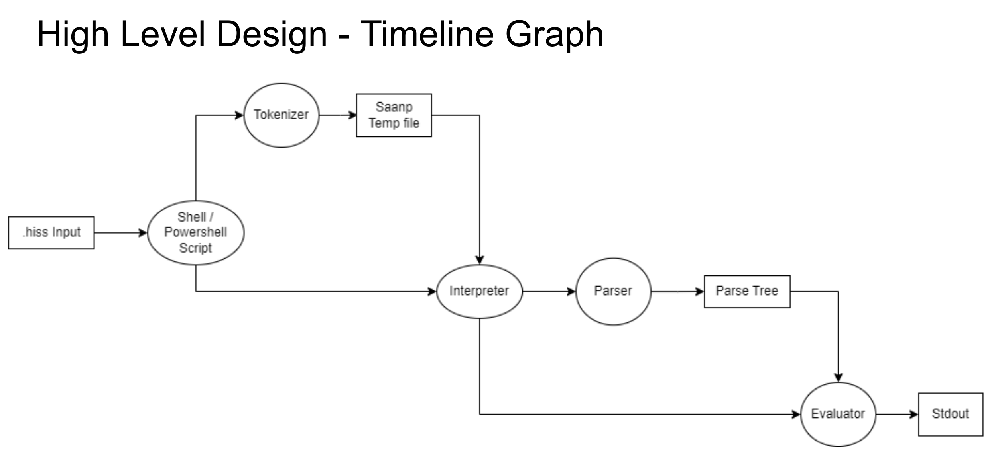
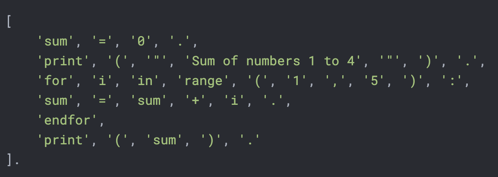
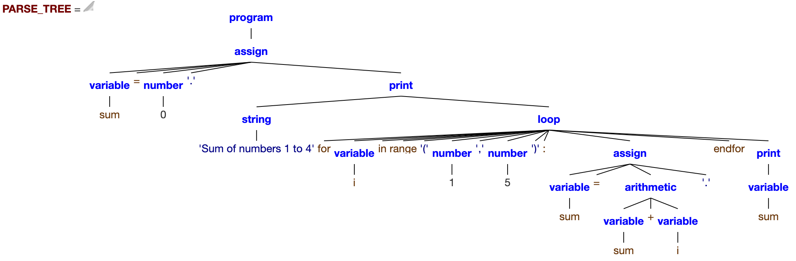
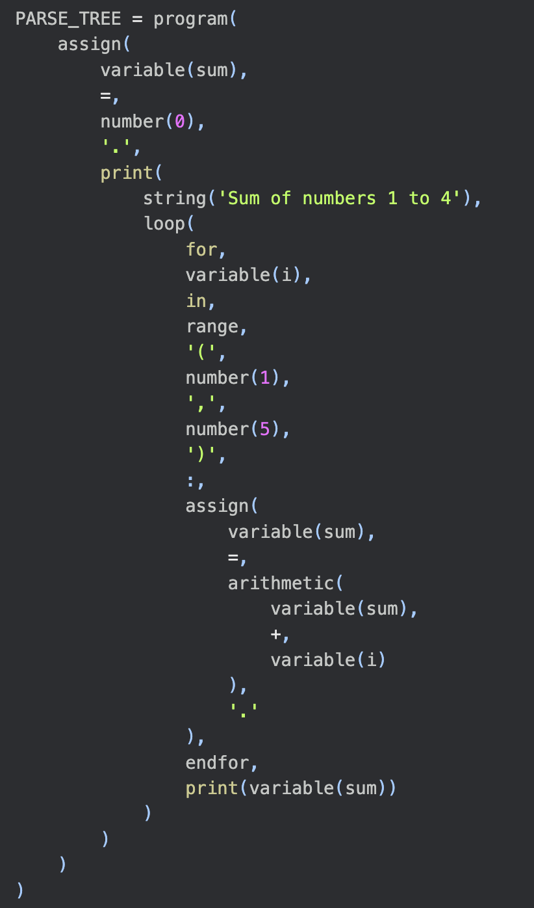
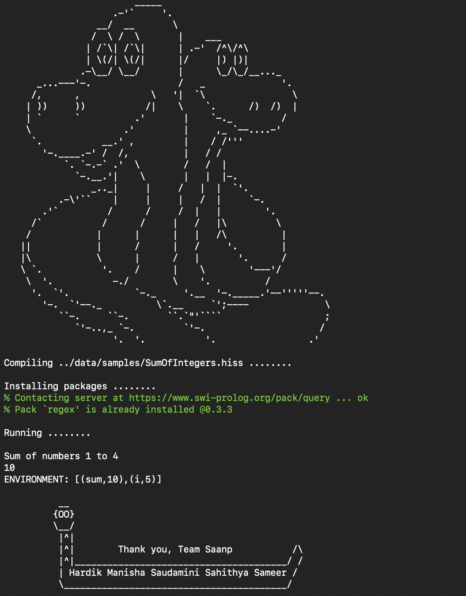

# SER 502: Team 26 - Final Project (Spring '23)


## SAANP (.hiss)

`SAANP` is a programming language that is inspired by the simpleness of `Python`.

It is easy to code in, therefore useful for beginners. However, unlike `Python` which relies on indentation, `SAANP` takes inspiration from `C`, but uses `.` to separate the statements and `endif/endwhile/endfor` to determine the end of block.

`SAANP`, similar to `Python`, is a dynamically typed language, and variable declaration can happen anywhere throughout the program.

> **Note** - The declared variables are available in the global scope, for the rest of the program.

For detailed language specification: **[SER502-Spring2023-Team26-Milestone1.pdf](./doc/SER502-Spring2023-Team26-Milestone1.pdf)**

Project Video: **[YouTube](https://www.youtube.com/watch?v=8c6JyjyNlEI)**

### How to

### Prerequisites for execution

- In Mac/Linux, execution permission will be required to run **saanp.sh**. One can do so by running the following command - `chmod +x saanp.sh`
- In Windows, permission is required to run powershell scripts. Run the following command in Powershell **(Run as administrator)** - `set-executionpolicy remotesigned`

> **Note** - `parser.pl` is using a third-party library for **regular expressions** and if one does not have the package installed in their prolog installation, `SAANP` will provide a prompt upon execution, to install the package. One will require to say `yes` to the prompt.

### Execution Steps

LINUX/ MAC OS:

- Go to the **src** folder - `cd src`
- Run **saanp.sh** with a `.hiss` file as an argument - `./saanp.sh <Path to .hiss file>`

Windows:

- Go to the **src** folder - `cd src`
- Run **saanp.ps1** with a `.hiss` file as an argument - `.\saanp.ps1 <Path to .hiss file>`

### Syntax Examples

IF STATEMENTS

```python
if x == 1:
   y = 2.
	if z != 3:
		y = y + 1.
	endif
endif

if x > 1:
   y = 2.
else:
   y = 3.
endif
```

TERNARY EXPRESSION

```python
x = 3.
y = 9.
print(x).
print(y).

z = x > y ? x : y.
print("Greater Number:").
print(z).
```

WHILE-LOOP

```python
print(“Remainder of 15/3”).
num1 = 15.

while num1 > -1:
   num1 = num1 - 3.
endwhile

print(num1).
```

TRADITIONAL FOR-LOOP

```python
print(“Even numbers:”).
for i = 2, i < x , i = i + 2:
   print(i).
endfor
```

ENHANCED FOR-LOOP

```python
sum = 0.
print("Sum of numbers 1 to 5").

for i in range(1, 5):
    sum = sum + i.
endfor

print(sum).
```

> **Note** - Nesting is supported.

Variables names can be a combination, of any length `> 0`, of the small alphabets `a-z`, underscore `_` and digits `0-9`, but should not begin with a number. It cannot match the reserved keywords.
 
Reserved Keywords: `True`, `False`, `if`, `else`, `endif`, `for`, `endfor`, `while`, `endwhile`, `range`, `print`.
 
Language doesn't support the following syntax:

- More than 1 logical operator in a boolean expression `ex1 and not ex2`.
- Assignment in an expression `if x=1: ...`.
- `integer` or `string` value as a boolean expression `x=2. if x: ...`.
- Double quotes within a string literal `x=”He said “Ok”.”.`.

### Tools Used

- **Tokenizer** - Python (3.8.0+)
- **Parser** - Prolog (SWI-Prolog version 9.0.4)
- **Evaluator** - Prolog (SWI-Prolog version 9.0.4)
- **Execution in MacOS/Linux** - Bash/Shell
- **Execution in Windows** - Powershell

### Execution Process



**1. Input**

```python
sum = 0.
print("Sum of numbers 1 to 4").

for i in range(1, 5):
    sum = sum + i.
endfor

print(sum).
```

**2. Tokenization**



**3. Parsing**




**4. Evaluation**



### Thank You!
